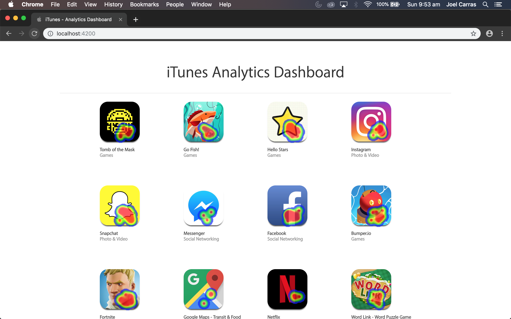

    

# How it works

## Data Delivery
The server streams the AppStoreItem items when the client connects. AppStoreItem.heatMapData is an Observable which allows each AppStoreItemComponent to subscribe for updates individually. The websocket delivers new HeatMapUpdate updates to the client. In the AppStoreService the observables are kept in an object (heatMapObservables) so it doesn't need to iterate through the AppStoreItems to find and publish an update.

## Viewport Refresh
The AppStoreItemComponent uses the IntersectionObserver which allows the component to observe when an item is visible in the viewport. If an AppStoreItemComponent receives an update while it's outside of the viewport the points are queued and the heatmap is refreshed when it becomes visible.

## Install

To setup run `npm install`

## To start server and frontend

To setup run `npm start`

## To start frontend

To setup run `npm start:frontend`

## To start server

To setup run `npm start:server`

Once app is running open http://localhost:4200/
